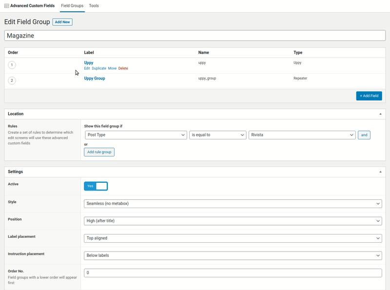

[](https://www.gnu.org/licenses/gpl-3.0)

# ACF Uppy Field (WordPress Plugin)

_ACF Uppy Field_ is a WordPress plugin that adds a new "Uppy" custom field to the list of fields of the [Advanced Custom Fields](https://www.advancedcustomfields.com) plugin.  
This "Uppy" custom field allows you to overcome the limits of the default "File" field present in ACF, and to __upload files of all types and sizes__ via the [TUS protocol](https://tus.io) and the [Uppy JS uploader](https://uppy.io), regardless of the limits set on the server side (there is no need to increase INI parameters like _upload_max_filesize_, _post_max_size_, _max_execution_time_, _memory_limit_, etc.).

<!-- 
https://stackoverflow.com/a/46701929/3929620
https://stackoverflow.com/a/29842302/3929620
 -->


### Requirements

- PHP v7.1 or upper
- WordPress v5.x
- [Advanced Custom Fields](https://www.advancedcustomfields.com) v5.x

### Recommendations

- [Composer](https://getcomposer.org/)

### Features

- use official [Advanced Custom Fields - Field Type Template](https://github.com/AdvancedCustomFields/acf-field-type-template)
- use [TUS protocol](https://tus.io)
- use [Uppy JS uploader](https://uppy.io)
- made with [Vanilla JS](http://vanilla-js.com) (no jQuery)
- autoload classes with Composer and PSR-4
- assets built with Webpack
- support ACF nested repeater
- no limits by default for upload file size and types
- support setting per-field size limit, mime-types and upload path
- support uploads outside public directory (for private files)
- download file using symlinks (no memory problems with large downloads)
- many WP hooks available

### Installation

1. Copy the `acf-uppy` folder into your `wp-content/plugins` or `wp-content/mu-plugins` folder.
1. Run this command inside the `acf-uppy` folder:
   
   ```sh
   $ composer install
   ```
   _Alternatively, if you don't have shell access to your hosting space, [read here](https://ehikioya.com/how-to-install-php-packages-without-composer/)_.
1. Activate the `Advanced Custom Fields: Uppy` plugin via the plugins admin page.
1. Create a new field via ACF and select the `Uppy` type.
1. Read the description above for advanced usage instructions.

### Actions

```php
do_action( 'acf_uppy/download_fallback', $postId );
```
- `$postId` _(int)_: The ID of the post containing _ACF Uppy Field_.

```php
do_action( 'acf_uppy/download_fallback/type={$postType}', $postId );
```
- `$postId` _(int)_: The ID of the post containing _ACF Uppy Field_.
- `$postType` _(string)_: The type of the post containing _ACF Uppy Field_.

### Filters

```php
apply_filters( 'acf_uppy/dest_path', $destPath );
```
- `$destPath` _(string)_: The file destination absolute base path.  
Default: `{ABSPATH}wp-content/uploads/acf-uppy`.

```php
apply_filters( 'acf_uppy/dest_path/type={$postType}', $destPath, $postId, $field );
```
- `$destPath` _(string)_: The file destination absolute base path.  
Default: `{ABSPATH}wp-content/uploads/acf-uppy`.
- `$postType` _(string)_: The type of the post containing _ACF Uppy Field_.
- `$postId` _(int)_: The ID of the post containing _ACF Uppy Field_.
- `$field` _(array)_: The field array holding all the field options.

```php
apply_filters( 'acf_uppy/tmp_path', $tmpPath );
```
- `$tmpPath` _(string)_: The file temporary absolute path.  
Default: `{sys_get_temp_dir()}/acf-uppy/{get_current_user_id()}`.

```php
apply_filters( 'acf_uppy/symlink_url', $symlinkUrl );
```
- `$symlinkUrl` _(string)_: The symlinks absolute base url.  
Default: `{site_url()}/wp-content/plugins/acf-uppy/symlink`.

```php
apply_filters( 'acf_uppy/symlink_path', $symlinkPath );
```
- `$symlinkPath` _(string)_: The symlinks absolute base path.  
Default: `{ABSPATH}wp-content/plugins/acf-uppy/symlink`.

```php
apply_filters( 'acf_uppy/base_path', $basePath );
```
- `$basePath` _(string)_: The base url endpoint.  
Default: `acf-uppy`.

```php
apply_filters( 'acf_uppy/api_path', $apiPath );
```
- `$apiPath` _(string)_: The TUS base url endpoint.  
Default: `wp-tus`.

```php
apply_filters( 'acf_uppy/cache', $cacheType );
```
- `$cacheType` _(string)_: The TUS cache type.  
Options: `redis`, `apcu` or `file`.  
Default: `file`.

```php
apply_filters( 'acf_uppy/cache_ttl', $cacheTtl );
```
- `$cacheTtl` _(string)_: The TUS cache TTL in secs.  
Default: `86400`.

```php
apply_filters( 'acf_uppy/file_name_exists', $fileName, $destPath, $pathinfo, $counter );
```
- `$fileName` _(string)_: The file name renamed.  
Default: `{$pathinfo['filename']}-{$counter}.{$pathinfo['extension']}`.
- `$destPath` _(string)_: The directory absolute path to the file. 
- `$pathinfo` _(array)_: The [pathinfo](https://www.php.net/manual/en/function.pathinfo.php) of the file. 
- `$counter` _(int)_: The incremented counter. 

```php
apply_filters( 'acf_uppy/file_name', $fileName, $destPath );
```
- `$fileName` _(string)_: The file name. 
- `$destPath` _(string)_: The directory absolute path to the file. 

```php
apply_filters( 'acf_uppy/download_hash', $hash, $destFile, $postId );
```
- `$hash` _(int|string)_: The hash used in download url.  
Default: `wp_hash( $destFile )`.
- `$destFile` _(string)_: The absolute path of the file. 
- `$postId` _(int)_: The ID of the post containing _ACF Uppy Field_.

```php
apply_filters( 'acf_uppy/download_hash/type={$postType}', $hash, $destFile, $postId );
```
- `$hash` _(string)_: The hash used in download url.  
Default: `wp_hash( $destFile )`.
- `$postType` _(string)_: The type of the post containing _ACF Uppy Field_.
- `$destFile` _(string)_: The absolute path of the file. 
- `$postId` _(int)_: The ID of the post containing _ACF Uppy Field_.

```php
apply_filters( 'acf_uppy/download_allow', $allow, $destFile, $postId );
```
- `$allow` _(bool)_: Whether or not to allow the file download. 
- `$destFile` _(string)_: The absolute path of the file. 
- `$postId` _(int)_: The ID of the post containing _ACF Uppy Field_.

```php
apply_filters( 'acf_uppy/download_allow/type={$postType}', $allow, $destFile, $postId );
```
- `$allow` _(bool)_: Whether or not to allow the file download. 
- `$postType` _(string)_: The type of the post containing _ACF Uppy Field_.
- `$destFile` _(string)_: The absolute path of the file. 
- `$postId` _(int)_: The ID of the post containing _ACF Uppy Field_.

```php
apply_filters( 'acf_uppy/download_symlink_delete_days', $days );
```
- `$days` _(int)_: Number of days before old symlinks are deleted.  
Default: `1`.

```php
apply_filters( 'acf_uppy/download_symlink_delete_max', $max );
```
- `$max` _(int)_: How many old symlinks need to be deleted on each request.  
Default: `10`.

### Webpack tasks

- Build sources: 

   ```sh
   $ npm run develop
   ```

- Start file watcher for recompiling: 

   ```sh
   $ npm run watch
   ```

- Build sources for production: 

   ```sh
   $ npm run production
   ```

### Changelog

See auto-[CHANGELOG](CHANGELOG.md) file.

### Roadmap

1. Add support for Uppy fields associated with WP users.
1. Test PHP 8.x.

Do you need other features? Send me a [new enhancement](https://github.com/frugan-it/acf-uppy/labels/enhancement)!

### Contributing

For your contributions please use the [git-flow workflow](https://danielkummer.github.io/git-flow-cheatsheet/).

### Support

<!-- 
https://www.buymeacoffee.com/brand 
https://stackoverflow.com/a/26138535/3929620
https://github.com/nrobinson2000/donate-bitcoin
https://bitcoin.stackexchange.com/a/48744
https://github.com/KristinitaTest/KristinitaTest.github.io/blob/master/donate/Bitcoin-Protocol-Markdown.md
-->
[](https://buymeacoff.ee/frugan)

  
My BTC address `17juoYguPJ6rgGwtkBUaQZeNKMk3mEKkn5`.

### Usefull links

- https://www.advancedcustomfields.com/resources/creating-a-new-field-type/
- https://github.com/AdvancedCustomFields/acf-field-type-template
- http://youmightnotneedjquery.com
- http://vanilla-js.com/
- https://vanillajstoolkit.com
- https://hacks.mozilla.org/2018/03/es-modules-a-cartoon-deep-dive/
- https://dmitripavlutin.com/string-interpolation-in-javascript/
- https://github.com/ankitpokhrel/tus-php/wiki/WordPress-Integration
- https://github.com/transloadit/uppy/issues/179
- https://dev.to/konsole/resumable-file-upload-in-php-handle-large-file-uploads-in-an-elegant-way-4a84
- https://dev.to/oyetoket/fastest-way-to-generate-random-strings-in-javascript-2k5a
- https://mortoray.com/2014/04/09/allowing-unlimited-access-with-cors/
- https://www.html5rocks.com/en/tutorials/cors//
- https://developer.mozilla.org/en-US/docs/Web/HTTP/CORS/Errors/CORSNotSupportingCredentials#What_went_wrong
- https://choosealicense.com
- https://learnwithdaniel.com/2019/09/publishing-your-first-wordpress-plugin-with-git-and-svn/

### License

(ɔ) Copyleft 2021 [Frugan](https://about.me/frugan)
[GNU GPLv3](https://choosealicense.com/licenses/gpl-3.0/), see [COPYING](COPYING) file.
