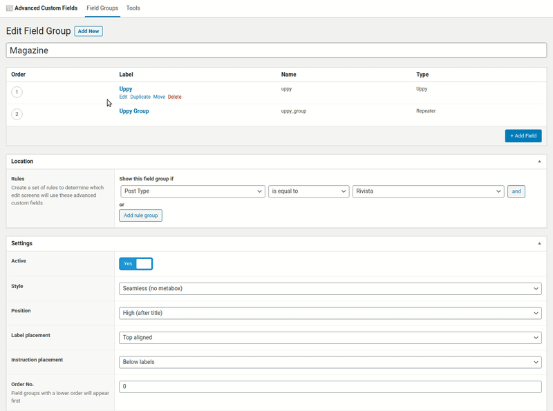

<!--


-->

> [!IMPORTANT]
> **🚧 Plugin Rework in Progress**  
> This plugin is currently undergoing a major rework to improve performance, security, and user experience. Please expect significant changes in upcoming versions. We recommend testing thoroughly in staging environments before updating to future releases.

# Upload Field with Uppy for ACF (WordPress Plugin)

__Upload Field with Uppy for ACF__ is a WordPress plugin that adds a new `Uppy` custom field to the list of fields of the [Advanced Custom Fields](https://www.advancedcustomfields.com) plugin. This custom field allows you to __upload files of all types and sizes__ using the [TUS protocol](https://tus.io) and the [Uppy JS uploader](https://uppy.io), overcoming the limitations of the default ACF `File` field. With __Upload Field with Uppy for ACF__, you no longer need to increase server-side INI parameters such as `upload_max_filesize`, `post_max_size`, `max_execution_time` and `memory_limit`.



## Requirements

- PHP ^8.0 *
- WordPress ^5.7 || ^6.0
- [Advanced Custom Fields](https://www.advancedcustomfields.com) ^5.9 || ^6.0
- APCu **

<sub><i>
_Note:_  
_* If you need to support older versions of PHP use [v1.x](../../tree/support/v1.x)._  
_** If your environment doesn't support APCu, you can try setting the cache to `file` with the `upload_field_with_uppy_for_acf/cache` filter, although `file` is not recommended in production (see [here](https://github.com/ankitpokhrel/tus-php/issues/408#issuecomment-1250229371))._
</i></sub>

## Features

- no limits by default for upload file size and types
- support setting per-field size limit, mime-types and upload path
- support uploads outside public directory (for private files)
- download file using symlinks (no memory problems with large downloads)
- many WP hooks available
- use [TUS protocol](https://tus.io)
- use [Uppy JS uploader](https://uppy.io)
- use official [ACF Example Field Type](https://github.com/AdvancedCustomFields/acf-example-field-type)
- support for logging with [Wonolog](https://github.com/inpsyde/Wonolog) ^2.x, if available
- made with [Vanilla JS](http://vanilla-js.com) (no jQuery)
- autoload classes with Composer and PSR-4
- assets built with Webpack
- support ACF nested repeater
- translations managed via [Crowdin](https://crowdin.com/project/upload-field-with-uppy-for-acf)

## Installation

You can install the plugin in three ways: manually, via Composer (wpackagist) _(coming soon)_ or via Composer (package).

<details>
<summary>Manual Installation</summary>

1. Go to the [Releases](../../releases) section of this repository.
2. Download the latest release zip file.
3. Log in to your WordPress admin dashboard.
4. Navigate to `Plugins` > `Add New`.
5. Click `Upload Plugin`.
6. Choose the downloaded zip file and click `Install Now`.

</details>

<details>
<summary>Installation via Composer "wpackagist" (coming soon)</summary>

If you use Composer to manage WordPress plugins, you can install it from [WordPress Packagist](https://wpackagist.org):

1. Open your terminal.
2. Navigate to the root directory of your WordPress installation.
3. Ensure your `composer.json` file has the following configuration: *

```json
{
    "require": {
        "composer/installers": "^1.0 || ^2.0",
        "wpackagist-plugin/upload-field-with-uppy-for-acf": "^3.0"
    },
    "extra": {
        "installer-paths": {
            "wp-content/plugins/{$name}/": [
               "type:wordpress-plugin"
            ]
        }
    }
}
```
4. Run the following command:

```sh
composer update
```

<sub><i>
_Note:_  
_* `composer/installers` might already be required by another dependency._
</i></sub>
</details>

<details>
<summary>Installation via Composer "package"</summary>

If you use Composer to manage WordPress plugins, you can install it from this repository directly:

1. Open your terminal.
2. Navigate to the root directory of your WordPress installation.
3. Ensure your `composer.json` file has the following configuration: *

```json
{
    "require": {
        "composer/installers": "^1.0 || ^2.0",
        "frugan-dev/upload-field-with-uppy-for-acf": "^3.0"
    },
    "repositories": [
        {
            "type": "package",
            "package": {
                "name": "frugan-dev/upload-field-with-uppy-for-acf",
                "version": "3.0.0",
                "type": "wordpress-plugin",
                "dist": {
                    "url": "https://github.com/frugan-dev/upload-field-with-uppy-for-acf/releases/download/v3.0.0/upload-field-with-uppy-for-acf.zip",
                    "type": "zip"
                }
            }
        }
    ],
    "extra": {
        "installer-paths": {
            "wp-content/plugins/{$name}/": [
               "type:wordpress-plugin"
            ]
        }
    }
}
```
4. Run the following command:

```sh
composer update
```

<sub><i>
_Note:_  
_* `composer/installers` might already be required by another dependency._
</i></sub>
</details>

## Configuration

Once installed:

1. In your WordPress admin dashboard, navigate to the `Plugins` section and click `Activate Plugin`.
2. Create a new field via ACF and select the `Uppy` type.
3. Read the description above for advanced usage instructions.

### Enabling Cache Busting

If you use filename-based cache busting, the plugin supports the following definition in `wp-config.php`:

```php
define('FRUGAN_UFWUFACF_CACHE_BUSTING_ENABLED', true);
```

For more information, see filename-based cache busting on [Nginx](https://github.com/h5bp/server-configs-nginx/blob/main/h5bp/location/web_performance_filename-based_cache_busting.conf) and [Apache](https://github.com/h5bp/server-configs-apache/blob/main/h5bp/web_performance/filename-based_cache_busting.conf).

## Actions

<details>
<summary>upload_field_with_uppy_for_acf/download_fallback</summary>

```php
do_action(FRUGAN_UFWUFACF_NAME_UNDERSCORE.'/download_fallback', $postId);
```
- `$postId` _(int)_: The ID of the post containing _Upload Field with Uppy for ACF_.

</details>

<details>
<summary>upload_field_with_uppy_for_acf/download_fallback/type={$postType}</summary>

```php
do_action(FRUGAN_UFWUFACF_NAME_UNDERSCORE.'/download_fallback/type={$postType}', $postId);
```
- `$postId` _(int)_: The ID of the post containing _Upload Field with Uppy for ACF_.
- `$postType` _(string)_: The type of the post containing _Upload Field with Uppy for ACF_.

</details>

## Filters

<details>
<summary>upload_field_with_uppy_for_acf/dest_path</summary>

```php
apply_filters(FRUGAN_UFWUFACF_NAME_UNDERSCORE.'/dest_path', $dest_path);
```
- `$dest_path` _(string)_: The file destination absolute base path.  
Default: `{ABSPATH}wp-content/uploads/uppy`.

</details>

<details>
<summary>upload_field_with_uppy_for_acf/dest_path/type={$postType}</summary>

```php
apply_filters(FRUGAN_UFWUFACF_NAME_UNDERSCORE.'/dest_path/type={$postType}', $dest_path, $postId, $field);
```
- `$dest_path` _(string)_: The file destination absolute base path.  
Default: `{ABSPATH}wp-content/uploads/uppy`.
- `$postType` _(string)_: The type of the post containing _Upload Field with Uppy for ACF_.
- `$postId` _(int)_: The ID of the post containing _Upload Field with Uppy for ACF_.
- `$field` _(array)_: The field array holding all the field options.

</details>

<details>
<summary>upload_field_with_uppy_for_acf/tmp_path</summary>

```php
apply_filters(FRUGAN_UFWUFACF_NAME_UNDERSCORE.'/tmp_path', $tmp_path);
```
- `$tmp_path` _(string)_: The file temporary absolute path.  
Default: `{sys_get_temp_dir()}/upload-field-with-uppy-for-acf/{get_current_user_id()}`.

</details>

<details>
<summary>upload_field_with_uppy_for_acf/symlink_url</summary>

```php
apply_filters(FRUGAN_UFWUFACF_NAME_UNDERSCORE.'/symlink_url', $symlink_url);
```
- `$symlink_url` _(string)_: The symlinks absolute base url.  
Default: `{site_url()}/wp-content/plugins/upload-field-with-uppy-for-acf/symlink`.

</details>

<details>
<summary>upload_field_with_uppy_for_acf/symlink_path</summary>

```php
apply_filters(FRUGAN_UFWUFACF_NAME_UNDERSCORE.'/symlink_path', $symlink_path);
```
- `$symlink_path` _(string)_: The symlinks absolute base path.  
Default: `{ABSPATH}wp-content/plugins/upload-field-with-uppy-for-acf/symlink`.

</details>

<details>
<summary>upload_field_with_uppy_for_acf/base_path</summary>

```php
apply_filters(FRUGAN_UFWUFACF_NAME_UNDERSCORE.'/base_path', $basePath);
```
- `$basePath` _(string)_: The base url endpoint.  
Default: `uppy`.

</details>

<details>
<summary>upload_field_with_uppy_for_acf/api_path</summary>

```php
apply_filters(FRUGAN_UFWUFACF_NAME_UNDERSCORE.'/api_path', $apiPath);
```
- `$apiPath` _(string)_: The TUS base url endpoint.  
Default: `wp-tus`.

</details>

<details>
<summary>upload_field_with_uppy_for_acf/cache</summary>

```php
apply_filters(FRUGAN_UFWUFACF_NAME_UNDERSCORE.'/cache', $cacheType);
```
- `$cacheType` _(string)_: The TUS cache type.  
Options: `redis`, `apcu` or `file`.  
Default: `apcu`.

</details>

<details>
<summary>upload_field_with_uppy_for_acf/cache_ttl</summary>

```php
apply_filters(FRUGAN_UFWUFACF_NAME_UNDERSCORE.'/cache_ttl', $cache_ttl);
```
- `$cache_ttl` _(string)_: The TUS cache TTL in secs.  
Default: `86400`.

</details>

<details>
<summary>upload_field_with_uppy_for_acf/file_name_exists</summary>

```php
apply_filters(FRUGAN_UFWUFACF_NAME_UNDERSCORE.'/file_name_exists', $fileName, $dest_path, $pathinfo, $counter);
```
- `$fileName` _(string)_: The file name renamed.  
Default: `{$pathinfo['filename']}-{$counter}.{$pathinfo['extension']}`.
- `$dest_path` _(string)_: The directory absolute path to the file. 
- `$pathinfo` _(array)_: The [pathinfo](https://www.php.net/manual/en/function.pathinfo.php) of the file. 
- `$counter` _(int)_: The incremented counter. 

</details>

<details>
<summary>upload_field_with_uppy_for_acf/file_name</summary>

```php
apply_filters(FRUGAN_UFWUFACF_NAME_UNDERSCORE.'/file_name', $fileName, $dest_path);
```
- `$fileName` _(string)_: The file name. 
- `$dest_path` _(string)_: The directory absolute path to the file. 

</details>

<details>
<summary>upload_field_with_uppy_for_acf/download_hash</summary>

```php
apply_filters(FRUGAN_UFWUFACF_NAME_UNDERSCORE.'/download_hash', $hash, $destFile, $postId);
```
- `$hash` _(int|string)_: The hash used in download url.  
Default: `wp_hash( $destFile )`.
- `$destFile` _(string)_: The absolute path of the file. 
- `$postId` _(int)_: The ID of the post containing _Upload Field with Uppy for ACF_.

</details>

<details>
<summary>upload_field_with_uppy_for_acf/download_hash/type={$postType}</summary>

```php
apply_filters(FRUGAN_UFWUFACF_NAME_UNDERSCORE.'/download_hash/type={$postType}', $hash, $destFile, $postId);
```
- `$hash` _(string)_: The hash used in download url.  
Default: `wp_hash( $destFile )`.
- `$postType` _(string)_: The type of the post containing _Upload Field with Uppy for ACF_.
- `$destFile` _(string)_: The absolute path of the file. 
- `$postId` _(int)_: The ID of the post containing _Upload Field with Uppy for ACF_.

</details>

<details>
<summary>upload_field_with_uppy_for_acf/download_allow</summary>

```php
apply_filters(FRUGAN_UFWUFACF_NAME_UNDERSCORE.'/download_allow', $allow, $destFile, $postId);
```
- `$allow` _(bool)_: Whether or not to allow the file download. 
- `$destFile` _(string)_: The absolute path of the file. 
- `$postId` _(int)_: The ID of the post containing _Upload Field with Uppy for ACF_.

</details>

<details>
<summary>upload_field_with_uppy_for_acf/download_allow/type={$postType}</summary>

```php
apply_filters(FRUGAN_UFWUFACF_NAME_UNDERSCORE.'/download_allow/type={$postType}', $allow, $destFile, $postId);
```
- `$allow` _(bool)_: Whether or not to allow the file download. 
- `$postType` _(string)_: The type of the post containing _Upload Field with Uppy for ACF_.
- `$destFile` _(string)_: The absolute path of the file. 
- `$postId` _(int)_: The ID of the post containing _Upload Field with Uppy for ACF_.

</details>

<details>
<summary>upload_field_with_uppy_for_acf/download_symlink_delete_days</summary>

```php
apply_filters(FRUGAN_UFWUFACF_NAME_UNDERSCORE.'/download_symlink_delete_days', $days);
```
- `$days` _(int)_: Number of days before old symlinks are deleted.  
Default: `1`.

</details>

<details>
<summary>upload_field_with_uppy_for_acf/download_symlink_delete_max</summary>

```php
apply_filters(FRUGAN_UFWUFACF_NAME_UNDERSCORE.'/download_symlink_delete_max', $max);
```
- `$max` _(int)_: How many old symlinks need to be deleted on each request.  
Default: `10`.

</details>

<details>
<summary>upload_field_with_uppy_for_acf/custom_post_types</summary>

```php
apply_filters(FRUGAN_UFWUFACF_NAME_UNDERSCORE.'/custom_post_types', $postTypes);
```
- `$postTypes` _(array)_: The types of the post containing _Upload Field with Uppy for ACF_.  
Default: `[]`.

</details>

## More info

See [LINKS](docs/LINKS.md) file.

## Changelog

See auto-[CHANGELOG](CHANGELOG.md) file.

## Contributing

For your contributions please use:

- [git-flow workflow](https://danielkummer.github.io/git-flow-cheatsheet/)
- [conventional commits](https://www.conventionalcommits.org)

## Sponsor

[](https://buymeacoff.ee/frugan)

## License

(ɔ) Copyleft 2024 [Frugan](https://frugan.it).  
[GNU GPLv3](https://choosealicense.com/licenses/gpl-3.0/), see [LICENSE](LICENSE) file.
